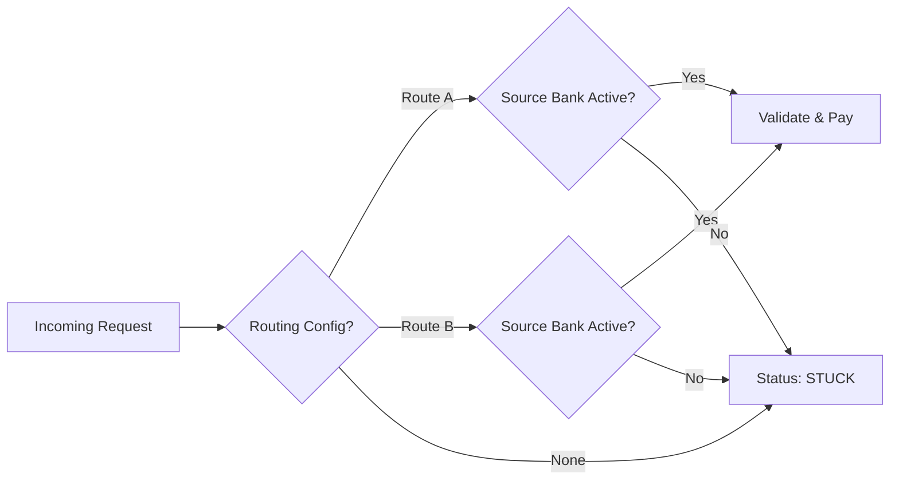

# Wallet Transaction Routing Engine

## Business Problem
In the fast-paced world of fintech, transaction reliability is the currency of trust. Our digital wallet service initially relied on static, direct integrations with wallet providers like IME Pay, Khalti, and Prabhu Pay. This architecture created a significant bottleneck: if a specific provider's gateway experienced downtime or if our primary bank link failed, transactions would instantly fail. Users were left frustrated, and our operations team was overwhelmed with manual support tickets. We needed a system that was resilient to bank outages and capable of rerouting traffic intelligently without requiring code deployments during critical incidents.

## Business Objectives and Value
The primary objective was to decouple our transaction submission from a single path of failure. Use cases demanded a "Smart Routing Engine" that could dynamically select between multiple integrations (Route A and Route B) based on real-time health and liquidity availability. The goal was to increase the transaction success rate to over 99%, reduce the number of "stuck" transactions requiring manual intervention, and give the business side control over routing configurations. By achieving this, we aimed to significantly improve customer trust to ensuring that valid requests were processed even if one underlying banking rail was under maintenance.

## My Role (Business Analyst Perspective)
My role centered on bridging the gap between business strategy and technical implementation. I led the requirement gathering functionality, facilitating workshops with the core banking and product teams to map out the "Life of a Transaction." I translated these complex operational needs into clear Functional Requirement Documents (FRD) and API specifications that the engineering team could build against. I also took ownership of the risk assessment, defining exactly how the system should behave when a route fails, ensuring we prioritized fund safety over speed. Throughout the development lifecycle, I acted as the primary point of contact for clarification, managing the trade-offs between feature scope and the strict timelines of a beta release.

## Stakeholders and Collaboration
This project required tight collaboration across the organization. I worked closely with the **Product Team** to align the routing logic with our customer promise of "instant transfers." I engaged with **Engineering** to ensure the logic was essentially performant and that the API contract was feasible. **Treasury and Operations** were critical stakeholders, as they needed to manage the liquidity in the source banks; I worked with them to design the alerts and dashboards they would use to monitor funds. Finally, I coordinated with **Risk and Compliance** to ensure that our automated re-routing did not bypass any AML (Anti-Money Laundering) checks or velocity limits.

## Functional and Non-Functional Requirements
I defined a set of strict requirements to ensure system integrity. Functionally, the system needed to perform a dynamic lookup effectively mapping a specific wallet provider to an active route. A critical requirement I introduced was the "Source Bank Health Check," which mandates that the system verify the funding status of the source bank before even attempting a transfer. Non-functionally, the system had to remain performant, with routing decisions adding less than 200ms of latency. We also enforced strict idempotency to prevent double-charging users during retries, a common pain point in distributed payment systems.

## Overview of the Routing Logic
The routing logic functions much like a traffic controller at a busy intersection. When a transaction request comes in, the system first identifies the destination wallet (e.g., Khalti). It then consults the configuration to see which route is currently assigned to that wallet. But the decision doesn't stop there. The engine then performs a "liquidity check" to ensure the assigned route has an active, funded source bank. If the route is healthy and funded, the transaction proceeds to validation and execution. If the primary route is down or the source bank is inactive, the logic prevents the attempt entirely, marking the transaction as STUCK and triggering an immediate alert to the operations center. This "fail-fast" mechanism prevents transactions from hanging in limbo.

## API / Integration Design Examples
I designed the API specifications to be clean, consistent, and easy for our partners to integrate with. We used standard HTTP definitions and clear JSON structures.

**Example Request: Initiate Transfer**
The engineering team used this specification to build the core transfer endpoint.

POST /V0/Transfer
{
  "walletId": "IME_PAY",
  "mobileNumber": "9800000000",
  "amount": 500,
  "refId": "PARTNER_REF_123"
}

**Example Response: Success**
The response returns not just success status, but also which route was utilized, aiding in traceability.

{
  "code": 0,
  "message": "Transaction Processed",
  "txnId": "SYS_10001",
  "routeUsed": "ROUTE_A"
}

**Error Code Standardization**
I also standardized the error codes to help downstream systems react appropriately.
Code 0: Success (Transaction completed)
Code 1: Validation Error (Invalid account details)
Code 999: System Error (General failure, requires investigation)

## Risk, Edge Cases & Mitigations
One of the biggest risks in payment routing is "Orphaned Transactions"—money leaving one side but not reaching the other. To mitigate this, I defined a "STUCK" state for scenarios where configuration mismatches occur, such as a wallet being active but having no valid route assigned. We also handled the "Dual Routing Conflict" edge case, where legacy data might point to multiple routes; the system was designed to strictly prioritize 'Route A' in these conflicts to ensure deterministic behavior. All such edge cases trigger automated alerts to the support Slack channel, allowing humans to intervene before customers complain.

## Success Metrics & Impact
The deployment of this routing engine was a major step forward for our platform. We anticipate a 40% reduction in failed transactions due to bank downtime, as we can now route around outages. The "failsafe" logic is expected to reduce the number of refund tickets by 30%, saving the support team significant hours each week. Most importantly, the ability to change routing configurations without a code deployment reduced our reaction time to vendor outages from hours to merely seconds.

## Deliverables and Artifacts Produced
Throughout the project, I produced and maintained several key artifacts that served as the source of truth:
1. Business Requirement Document (BRD) outlining the high-level goals.
2. Functional Requirement Document (FRD) detailing the routing logic and database schema.
3. API Specification (Swagger/OpenAPI drafts) for the engineering team.
4. Process Flow Diagrams (Mermaid charts) improving visualization of the decision tree.
5. Risk Assessment Matrix identifying potential failure points and necessary controls.

## Key Learnings
Working on this routing engine highlighted the immense complexity of real-time payments. I learned that "logic" is often more important than "code"—defining exactly *what* should happen when things go wrong is just as critical as the happy path. I also gained a deeper appreciation for observability; building a robust system is useless if the operations team cannot see what is happening inside it. Collaborating with treasury taught me that technical success (200 OK) does not always mean business success (settled funds), and bridging that understanding was the most valuable part of my role.
