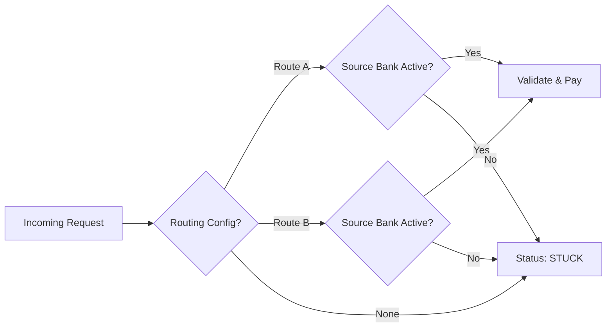

# Wallet Transaction Routing Engine

## 📌 Executive Summary

This repository documents the **Smart Routing Engine** designed to orchestrate wallet top-ups and transfers (e.g., IME Pay, Prabhu Pay) across multiple payment rails. The system ensures high success rates by dynamically routing transactions to the most stable or cost-effective "Route Module" (e.g., Route A vs. Route B) based on real-time configuration.

## 📂 Repository Structure

| Directory | Content Description |
|-----------|-------------------|
| **[Requirements](./documentation/Requirements/)** | Logic for selection, source bank validation, and error handling. |
| **[API Specification](./documentation/API/)** | Endpoints for Transfer, Validation, and Routing. |
| **[Process Flows](./documentation/Process-Flows/)** | Visual diagrams of the Decision Tree. |
| **[Testing](./documentation/Testing/)** | QA Test Scenarios for different routing conditions. |

## ⚙️ How It Works

The routing logic acts as a traffic controller:

1.  **Ingestion**: A transfer request comes in for a specific wallet provider (e.g., "Wallet X").
2.  **Lookup**: System checks detailed configuration to see which Route (A or B) handles "Wallet X".
3.  **Health Check**: Verifies if the selected route has an **Active Source Bank** required to fund the transaction.
4.  **Execution**:
    *   **Pass**: Validate Account -> Debit Source -> Credit Wallet.
    *   **Fail**: If no route or no bank is active, the transaction ends in a `STUCK` / `ERROR` state to prevent fund loss.

## 📊 Logic Snapshot

> *See [Routing Diagrams](./documentation/Process-Flows/Routing_Diagrams.md) for full detail.*

---

## 🛠 Features

- **Dynamic Switching**: Change routing from Route A to Route B instantly via config without code changes.
- **Fail-Safe**: Strict validation of "Source Bank" liquidity before attempting a transfer.
- **Visibility**: Detailed status codes (`000` for success, `999` for failure) for easy debugging.

---
