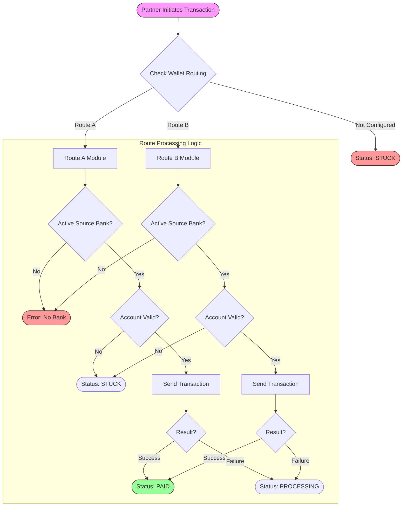

# Routing Decision Flowchart

This diagram illustrates the decision logic for incoming wallet transactions.

```mermaid
flowchart TD
    Start([Partner Initiates Transaction]) --> RouteCheck{Check Wallet Routing}
    
    RouteCheck -- "Route A" --> ModuleA[Route A Module]
    RouteCheck -- "Route B" --> ModuleB[Route B Module]
    RouteCheck -- "Not Configured" --> Stuck([Status: STUCK])
    
    subgraph RouteLogic [Route Processing Logic]
        ModuleA --> BankCheckA{Active Source Bank?}
        ModuleB --> BankCheckB{Active Source Bank?}
        
        BankCheckA -- No --> ErrorBank([Error: No Bank])
        BankCheckB -- No --> ErrorBank
        
        BankCheckA -- Yes --> ValidateA{Account Valid?}
        BankCheckB -- Yes --> ValidateB{Account Valid?}
        
        ValidateA -- No --> StuckAccount([Status: STUCK])
        ValidateB -- No --> StuckAccount
        
        ValidateA -- Yes --> SendA[Send Transaction]
        ValidateB -- Yes --> SendB[Send Transaction]
        
        SendA --> ResultA{Result?}
        SendB --> ResultB{Result?}
        
        ResultA -- Success --> Paid([Status: PAID])
        ResultA -- Failure --> Processing([Status: PROCESSING])
        
        ResultB -- Success --> Paid
        ResultB -- Failure --> Processing
    end
    
    style Start fill:#f9f,stroke:#333
    style Paid fill:#9f9,stroke:#333
    style Stuck fill:#f99,stroke:#333
    style ErrorBank fill:#f99,stroke:#333
```
